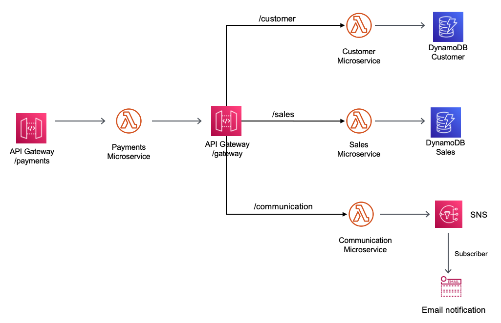

## Integrating microservices by using AWS serverless services
## API gateway pattern - Synchronous Communication

This is a Java implementation of the API Gateway Pattern as described in the official AWS documentation
https://docs.aws.amazon.com/prescriptive-guidance/latest/modernization-integrating-microservices/api-gateway-pattern.html

In this example we have implemented the Single API gateway using a request-response synchronous communication style.
Synchronous communication requires the caller microservice to wait for a response from other microservices.
The trade-off of this pattern is the latency caused by the downstream microservices.

Reference: https://docs.aws.amazon.com/prescriptive-guidance/latest/modernization-integrating-microservices/api-gateway-pattern.html

Topology


Important: this application uses various AWS services and there are costs associated with these services after the Free Tier usage - please see the AWS Pricing page for details. You are responsible for any AWS costs incurred.

## Language:
#### This is a Maven project which uses Java 11 and AWS SDK

## Framework
The framework used to deploy the infrastructure is SAM

## Services used

The AWS services used in this pattern are
#### API Gateway - AWS Lambda - DynamoDB - Amazon SNS

## Description
The SAM template contains all the information to deploy AWS resources and also the permission required by these service to communicate.

You will be able to create and delete the CloudFormation stack using the CLI commands.

This is fully functional example implemented in Java 11.

## Use case:

In this use case, a customer makes regular monthly payments in an insurance system that consists of four
microservices deployed as Lambda functions ("Customer," "Communication," "Payments," and "Sales").

The “Customer” microservice updates the customer database with the monthly payment details.

The  “Sales” microservice updates the sales database with relevant information that helps the sales team
follow up with the customer for cross-selling opportunities.

The “Communication” microservice sends a confirmation email to the customer after the payment is successfully processed. Finally, the “Payments”
microservice is the overall system that the customer uses to make their monthly payment.

The pattern uses web services to integrate the "Customer," "Sales," and "Communication" subsystems with the
"Payments" microservice.

## Deployment commands

````
mvn clean package

# create an S3 bucket where the source code will be stored:
aws s3 mb s3://ujjdsni2993indqd1

# copy the source code located in the target folder:
aws s3 cp target/sourceCode.zip s3://ujjdsni2993indqd1

# SAM will deploy the CloudFormation stack described in the template.yml file:
sam deploy --s3-bucket ujjdsni2993indqd1 --stack-name api-gateway-pattern --capabilities CAPABILITY_IAM

````

## Testing

To test the endpoint first send data using the following command. Be sure to update the endpoint with endpoint of your stack.

```
# Subscribe to the SNS Topic to receive the confirmation email

# use aws cli to show the SNS Topics
aws sns list-topics

# subscribe to the SNS topic with your email address and confirm your subscription
aws sns subscribe \
    --topic-arn arn:aws:sns:eu-central-1:YOUR_AWS_ACCOUNT:Communication \
    --protocol email \
    --notification-endpoint YOUR_EMAIL@DOMAIN.com
    
    
# Copy the API Gateway URL for the Payments endpoint from the sam deploy outputs
#  i.e. 
# Outputs                                                                                                                                                                                                                             
# -------------------------------------------------------------------------------------------------------------------------------------------------------------------------------------------------------------------------------------
# Key                 PaymentsEndpoint                                                                                                                                                                                                      3
# Description         API Gateway Payments Endpoint                                                                                                                                                 
# Value               https://______________/prod/payments


# Call the API Gateway 

curl -X POST https://API_GATEWAY_URL -H "Content-Type: application/json" -d '{"customerId": "111-222","customerFullName":"John Smith","customerEmail": "john.smith@example.com","amount": "9.99","product": "car insurance"}' 

# you should receive an email with the information
# and also see in the console the paymentId
# i.e. {"paymentId":"7a6013d7-8f9e-4ffa-9961-96c18136997c"}

# Scan the DynamoDB CustomerPayments 
aws dynamodb scan --table-name CustomerPayments

# Scan the DynamoDB Sales 
aws dynamodb scan --table-name Sales    
```

### API Gateway time out

If you call for the first time the API Gateway Payments endpoint it is possible to receive this message
{"message": "Endpoint request timed out"}, but still be able to receive the confirmation email.

This happens for two reasons:
1. The AWS API Gateway has 30 seconds timeout and cannot be increased
   Ref: https://docs.aws.amazon.com/apigateway/latest/developerguide/limits.html
2. The Lambda function cold start which will create some latency
   Ref: https://aws.amazon.com/blogs/compute/operating-lambda-performance-optimization-part-1/

## Cleanup

Run the given command to delete the resources that were created. It might take some time for the CloudFormation stack to get deleted.
```
aws cloudformation delete-stack --stack-name api-gateway-pattern

aws s3 rm s3://ujjdsni2993indqd1 --recursive

aws s3 rb s3://ujjdsni2993indqd1
```

## Requirements

* [Create an AWS account](https://portal.aws.amazon.com/gp/aws/developer/registration/index.html) if you do not already have one and log in. The IAM user that you use must have sufficient permissions to make necessary AWS service calls and manage AWS resources.
* [AWS CLI](https://docs.aws.amazon.com/cli/latest/userguide/install-cliv2.html) installed and configured
* [Git Installed](https://git-scm.com/book/en/v2/Getting-Started-Installing-Git)
* [AWS Serverless Application Model](https://docs.aws.amazon.com/serverless-application-model/latest/developerguide/serverless-sam-cli-install.html) (AWS SAM) installed


## Author bio
Name: Razvan Minciuna
LinkedIn: https://www.linkedin.com/in/razvanminciuna/
Description: Software Architect


